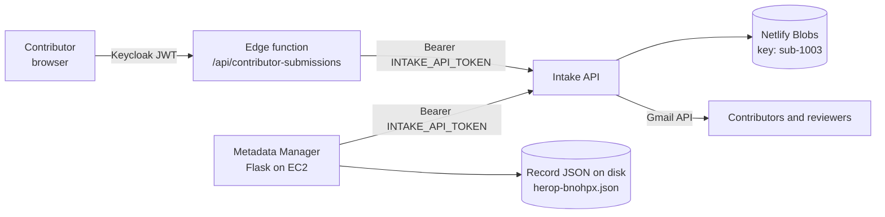

# SDOH Place Intake API

Small Netlify-hosted submission intake API for the SDOH Place contributor workflow.

It implements the API used by both:

- `sdohplace-data-discovery`
- `SDOHPlace-MetadataManager`

## Endpoints

```text
GET    /submissions
POST   /submissions
GET    /submissions/:id
PATCH  /submissions/:id
DELETE /submissions/:id?actor=contributor|admin&reviewer=<name>
POST   /submissions/:id/decision
POST   /submissions/:id/published
POST   /submissions/:id/record-deleted
POST   /email/test
```

All non-`OPTIONS` requests require:

```text
Authorization: Bearer <INTAKE_API_TOKEN>
```

`POST /email/test` renders any template and (unless dry-run) sends it, without
creating a submission:

```bash
curl -X POST https://<intake-api>/email/test \
  -H "Authorization: Bearer $INTAKE_API_TOKEN" \
  -H "Content-Type: application/json" \
  -d '{"to":"you@example.org","template":"submission_received"}'
```

Post an empty body (`{}`) to list template names and the current mailer config.

## Local setup

```bash
cp .env.example .env
npm install
npm run dev
```

Netlify Dev serves the API at:

```text
http://localhost:9090/submissions
```

Point both existing apps at it:

```env
INTAKE_API_BASE_URL=http://localhost:9090
INTAKE_API_TOKEN=change-me
```

Use the same token value in this project and in the caller apps.

## Deploy to Netlify

Set these environment variables in Netlify:

```env
INTAKE_API_TOKEN=<strong-random-token>
INTAKE_API_CORS_ORIGINS=https://your-discovery-site,https://your-metadata-manager-site
INTAKE_STORE_NAME=submissions
```

Do not set `INTAKE_STORAGE_DRIVER=file` in Netlify production. That local-only setting is used by Netlify Dev before the site has Netlify Blobs context.

Then deploy this repository to Netlify. Configure the other apps with:

```env
INTAKE_API_BASE_URL=https://your-intake-api.netlify.app
INTAKE_API_TOKEN=<same-token>
```

## Storage note

This project uses Netlify Blobs as a simple JSON data store. It is a good lightweight staging or low-volume solution. If submission volume or audit requirements grow, keep this HTTP contract and migrate the storage layer to DynamoDB/Postgres later.

## Data flow

Three services share one submission store. The discovery app never calls this
API directly from the browser: requests pass through its Netlify edge function,
which verifies the Keycloak token and attaches the caller's identity.



### Lifecycle stages

| Stage | Trigger | Writes | Where |
|---|---|---|---|
| 1. Draft / submit | Contributor saves | `sub-1003` with `site_origin`, `submitter_*`, `payload_json` | Netlify Blobs |
| 2. Review decision | Admin approves / rejects / needs changes | `status`, `review_notes`, `reviewed_by` | Netlify Blobs |
| 3. Record created | Admin runs "Add Records" on the Approved tab | `_meta.submission_id` on the record; `record_id` + `published_at` on the submission | EC2 disk + Blobs |
| 4. Record deleted | Admin deletes a record | `record_deleted_at` on the submission | Netlify Blobs |

### The two-way link

A submission and its published record point at each other, so either direction
is a direct lookup rather than a scan:

```text
submission sub-1003          record herop-bnohpx.json
  record_id: herop-bnohpx  →  _meta.submission_id: sub-1003
                           ←
```

`_meta.submission_id` is written in stage 3 and is what lets record deletion
find the submitter without listing every submission. `Record.to_json()`
rebuilds `_meta` on every save and explicitly preserves this key.

Records created before this link existed fall back to scanning submissions for
a matching `record_id`. Records authored directly in the manager have no
submission and correctly send no email.

### Inspecting state

```bash
# Submission (Netlify Blobs)
curl -s https://<intake-api>/submissions/sub-1003 \
  -H "Authorization: Bearer $INTAKE_API_TOKEN" | python3 -m json.tool

# Record (on the EC2 host)
python3 -c "import json;print(json.load(open('manager/metadata/records/herop-bnohpx.json'))['_meta'])"
```

## Email notifications

All email is sent from this service over the Gmail HTTPS API. Netlify Functions
run in Lambda, where outbound SMTP ports are blocked, so SMTP is not an option
here. The Metadata Manager no longer sends mail itself.

### When each email fires

| # | Trigger | Template | To | Subject |
|---|---|---|---|---|
| 1 | `POST /submissions` with `status: submitted` | `submission_received` | Contributor | SDOH & Place submission received: *title* |
| 2 | same as 1 | `reviewer_new_submission` | Reviewers | [SDOH & Place] New submission awaiting review: *title* |
| 3 | `PATCH` moving `needs_changes` → `submitted` | `reviewer_resubmission` | Reviewers | [SDOH & Place] Submission resubmitted after changes: *title* |
| 4 | `decision: approve` | `submission_approved` | Contributor | SDOH & Place submission approved: *title* |
| 5 | `decision: needs_changes` | `submission_needs_changes` | Contributor | SDOH & Place submission needs changes: *title* |
| 6 | `decision: reject` | `submission_rejected` | Contributor | SDOH & Place submission update: *title* |
| 7 | `POST /:id/published` | `submission_published` | Contributor | SDOH & Place submission is now live: *title* |
| 8 | `DELETE ?actor=contributor` | `reviewer_submission_withdrawn` | Reviewers | [SDOH & Place] Submission withdrawn by contributor: *title* |
| 9 | `DELETE ?actor=admin` | `submission_deleted` | Contributor | SDOH & Place submission removed: *title* |
| 10 | `DELETE ?actor=admin` | `reviewer_submission_deleted` | Reviewers | [SDOH & Place] Submission deleted by admin: *title* |
| 11 | `POST /:id/record-deleted` | `record_deleted` | Contributor | SDOH & Place record removed: *title* |
| 12 | any send failure | `admin_send_failure` | Admin | [SDOH & Place] Email delivery failed (*event*) |

Saving a draft sends nothing. A draft later promoted to `submitted` fires 1 and 2.

Reviewer subjects are prefixed `[SDOH & Place]` so they can be filtered or
forwarded with a single Gmail rule.

### Links inside emails

Contributor emails link to the site the submission came from, recorded as
`site_origin` at creation. The value is checked against `ALLOWED_SITE_ORIGINS`
before use; anything unrecognised falls back to `DISCOVERY_APP_URL`. This keeps
a staging or local submission from mailing out a production link, and stops an
arbitrary origin from appearing in SDOH-branded mail.

Reviewer emails link to `MANAGER_PUBLIC_URL` instead, since reviewers work in
the Metadata Manager.

### Changing an email

Templates live in `netlify/functions/lib/templates.mjs`, one entry per key in
the table above. The first line must be `Subject: ...`; the rest is the body.
Which event sends which template is wired in `netlify/functions/lib/notify.mjs`.

Sends never throw. A failure is logged, reported to the admin address, and the
submission write still succeeds — a broken mailer degrades to "no email", never
to lost data.

### Mail environment

```env
GMAIL_CLIENT_ID=
GMAIL_CLIENT_SECRET=
GMAIL_REFRESH_TOKEN=
GMAIL_SENDER=heroplab23@gmail.com
REVIEWER_EMAILS=heroplab23@gmail.com
ADMIN_ALERT_EMAILS=
CONTACT_EMAIL=heroplab23@gmail.com
DISCOVERY_APP_URL=https://search.sdohplace.org
MANAGER_PUBLIC_URL=https://metadata.sdohplace.org
ALLOWED_SITE_ORIGINS=http://localhost:3000,https://*--<site>.netlify.app
EMAIL_ENABLED=true
EMAIL_DRY_RUN=false
```

`EMAIL_ENABLED=false` skips sending entirely. `EMAIL_DRY_RUN=true` renders and
logs each message without delivering it — use it to check wording safely.
`ADMIN_ALERT_EMAILS` falls back to `REVIEWER_EMAILS` when unset.

Regenerate `GMAIL_REFRESH_TOKEN` with `node scripts/get-gmail-refresh-token.mjs`.
Keep the OAuth consent screen published ("In production"); in "Testing" status
Google expires refresh tokens after seven days.
